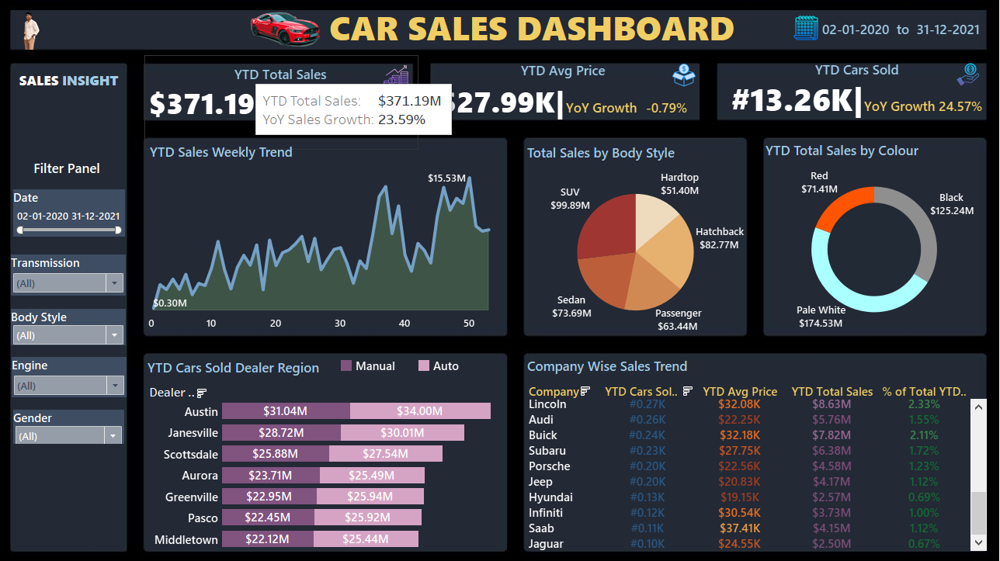

<h1 align="center">🚗 Car Sales Dashboard – Tableau Project</h1>

  
  
  

---

  

---

## 📌 Project Overview  

This **interactive Tableau dashboard** provides real-time insights into **car sales performance** using **KPIs, trends, and visual storytelling**.  
The goal is to **track growth, monitor performance**, and **identify opportunities** using clean, dynamic analytics.  

---

## 🎯 Problem Statement  

The dashboard is designed to:  
- Provide **real-time YTD sales insights**.  
- Enable **data-driven decisions** with visual analytics.  
- Highlight **growth opportunities** by segmenting data by **body style, region, and company performance**.  

---

## 🚀 Key KPIs  
- **YTD Total Sales** and **YoY Growth %**  
- **YTD Average Price** and **YoY Change**  
- **YTD Cars Sold** and **YoY Growth %**  

---

## 📊 Dashboard Features  
- **YTD Sales Weekly Trend** → Line chart of weekly sales performance  
- **Total Sales by Body Style** → Pie chart breakdown of SUV, Sedan, Hatchback, etc.  
- **Total Sales by Colour** → Donut chart showing color contribution  
- **Cars Sold by Dealer Region** → Bar chart of dealer performance  
- **Company-Wise Sales Trend** → Tabular summary with sales figures and KPIs  

---

## 🛠 Tools & Techniques  
- **Tableau Desktop** – Dashboard design and interactivity  
- **Excel Flat Files** – Data source  
- **Calculated Fields** – YTD, YoY metrics  
- **LOD Expressions** – Advanced calculations  
- **Interactive Filters & Formatting** – Clean and dynamic visual design  

---

## 📚 Learnings  
- Connecting Tableau to flat files  
- Using **date functions** for YTD & YoY  
- Creating **custom charts** and formatting dashboards  
- Applying **interactive filters** and **Level of Detail (LOD)**  
- Designing dashboards with **storytelling focus**  

---

## 🌐 Live Dashboard  

  <a href="https://public.tableau.com/app/profile/shanmukha.sai.bada/viz/CarSales_17568614319390/CarDashboard?publish=yes">
    👉 <b>View the Interactive Tableau Dashboard</b> 👈
  </a>

---
